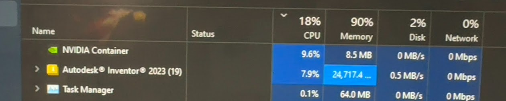
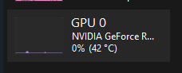
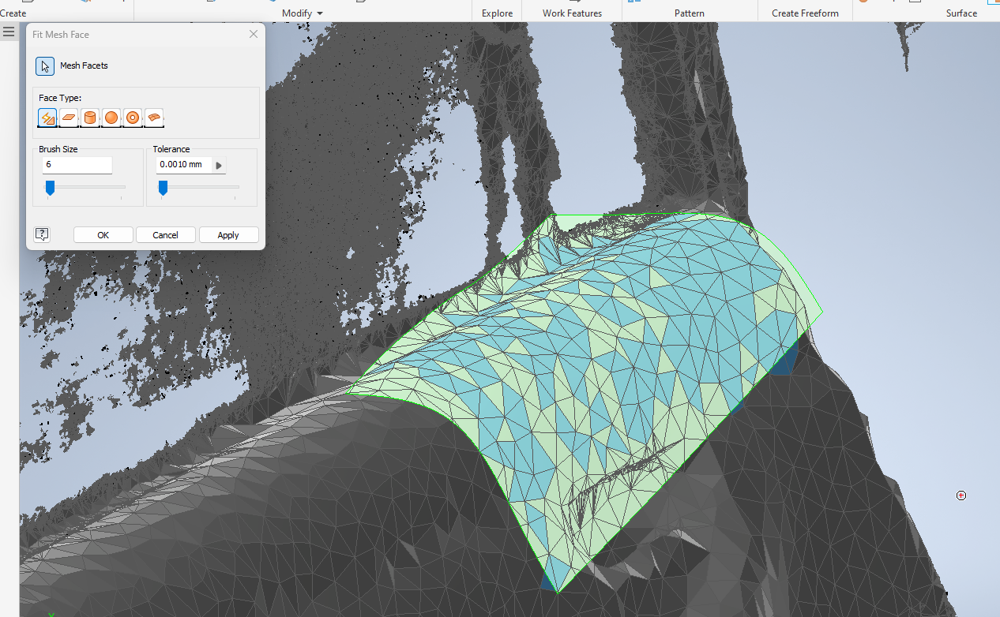
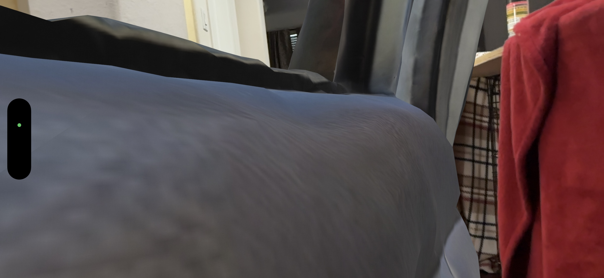
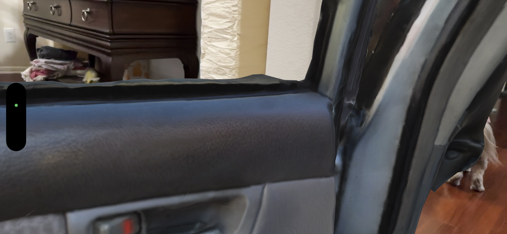

using inventor to refine a 3d scan from the TrueDepth camera on an iPhone XS using Heges


for some reason you need to download this random Add In and enable it in Inventor
```
https://apps.autodesk.com/INVNTOR/en/Detail/Index?id=6950391119076900441&appLang=en&os=Win64
```

now you can right click on the mesh in a new part and click "convert to base feature", change it to Solid/Surface and click ok


```
https://youtu.be/2sSX5-SFbkQ?si=VjsjXH4zEkVEpWXu
```



nice it has gpu accel mayb



nvm

---

time to give up




low poly 3d scan made in meshlab
- should've prob used rear lidar from the beginning, would've preserved scale

whatever

---

Reality Composer is unexpectedly trash at icp, damn <br>
(iphone 14 pro max / ipad pro fall 2022) 





prob useful for scale alignment in post

---

incredible scan detail from heges app


